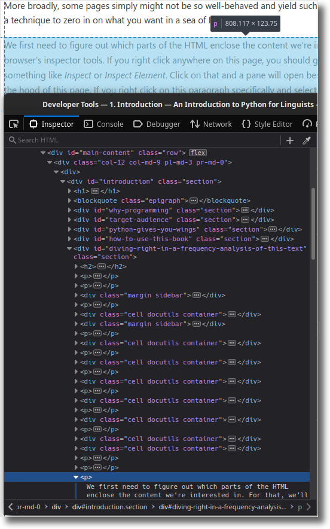

---
jupytext:
  formats: md:myst
  text_representation:
    extension: .md
    format_name: myst
    format_version: 0.13
    jupytext_version: 1.10.3
kernelspec:
  display_name: Python 3 (ipykernel)
  language: python
  name: python3
---

# Introduction

```{code-cell} ipython3
:tags: [remove-cell]

# Download NLTK resources. Remove code from START_NLTK_TMP to
# END_NLTK_TMP to store them in a permanent location instead of a
# temporary directory.
# --------------------------- START_NLTK_TMP ---------------------------
import os
import tempfile

nltk_data = os.path.join(tempfile.gettempdir(), "v4py", "nltk_data")
os.makedirs(nltk_data, exist_ok=True)
os.environ["NLTK_DATA"] = nltk_data
# ---------------------------- END_NLTK_TMP ----------------------------

import nltk

nltk.download(["punkt", "stopwords"])
```

```{epigraph}
On second thought, let's not go to [Camel](https://en.wikipedia.org/wiki/Perl#Camel)ot. ’Tis a silly place.

-- King Arthur, Monty [Python](https://python.org) and the Holy Grail
```

## Why programming?

When I suggest to fellow linguists that they might want to take up
programming as a way to supercharge their abilities to confront and
extract meaning from language data, I get a variety of responses. Among
the negative ones, two tend to dominate: a fear that it might be too
late to start anyway, and a dismissive attitude in the vein of "why
should I even care".

Let's examine these concerns in turn. Regarding the first one, it's
never too late, trust me. I myself started programming at uni, and not
even in my first year. Back then, I thought I was interested in literary
studies, and it took me a while to realize that my interests lay
elsewhere. Programming is perhaps the easiest skill to acquire from the
comfort of your own home, without the need for formal training (though
of course interacting with a live teacher can help jumpstart your
learning). There's a wealth of resources available via the internet,
this book being one example, and all you need to take full advantage of
them is a computer and an internet connection.

Much like any other learning experience, it's also a [journey that never
really ends](https://nedbatchelder.com/blog/202003/how_long_did_it_take_you_to_learn_python.html).
There's always room for improvement and for learning more, so you might
as well start now and get on with it. For my part, it's been almost ten
years since I set out, and while I consider myself a fairly proficient
programmer by this point, I learn new stuff all the time. If you're
anything like me, that sense of curiosity that got you into linguistics,
and perhaps even an academic career, is likely to be rewarded by
pursuing programming as well.

I would argue that this sense of curiosity is also what should prevent
you from having that second kneejerk negative response, "why should I
even care". For my part, I can tell you that **programming is very
likely the most useful skill I acquired since learning to read**. It
really expanded the range of what I'm able to achieve not just in
linguistics, but in everyday life as well. Our society increasingly
relies on software to go about its daily business, and being able to
program puts me in much better control of the tools I must willy-nilly
use to be a part of it.

One concrete example: have you ever had a month to provide feedback on a
Microsoft Word document, only to find yourself pulling an all-nighter
just before the deadline because there just wasn't time earlier, and
feeling ashamed of the trail of 3AM timestamps you're leaving behind?
Word offers the nuclear option of removing all metadata in tracked
changes and comments across the board, but that includes author names,
which is very conspicuous and feels like an even more flagrant admission
of guilt, plus if there are multiple authors, you might need to keep
them anyway. Luckily, it turns out you can tease the document apart
using a [Python script](https://gist.github.com/dlukes/2b5c2a163cd8adba420aaae0c8ea2c00)
and selectively target those pesky timestamps associated with your
username. (If this doesn't sound familiar at all, then congratulations,
you don't have OCD!)

But admittedly, these are just words, to see for yourself, you're going
to have to get your hands dirty and spend some time learning what
programming feels like, and what it empowers you to do, what new,
unsuspected perspectives it opens. This book is an attempt to help you
get started on that path. And if it doesn't strike a chord with you, it
might at least point you to [other related resources](outro), some of
which will hopefully be a better fit.

If on the other hand, it turns out this book *is* a good fit for you,
then great! And if you end up on the fence, then please consider
helping us improve it for future readers like you. The source code of
this book lives in a [GitHub
repository](https://github.com/v4py/v4py.github.io). Please open issues
with requests for clarification, tips for improvement, or even just
typos!

## Target audience

This book is intended as an introduction to programming using the
[Python](https://python.org) programming language. No previous
programming experience is required, though a basic amount of [technical
sophistication](https://www.learnenough.com/command-line-tutorial/basics#aside-technical_sophistication)
is needed; you will hopefully acquire a lot more by the time you're done
reading it.

If you've programmed before, but not in Python, or even in Python, but
not with a focus on language data, you might still glean useful
information from this book, though the pace might feel sluggish at
times. And even if you feel at home in both these areas, there might be
tricks or gotchas addressed herein that will help you further refine
your skills, though of course your mileage may vary.

Finally, if you've never programmed, have no background in linguistics
and are not particularly computer-literate, reading this book might
prove somewhat challenging, though not impossible with the right amount
of dedication. If you make it through, or at least part-way, your
feedback on how to make the parts you struggled with more accessible
would be absolutely invaluable!

## Python gives you wings!

```{margin}

```

So what is this [Python](https://python.org/) business all about? I've
said before that learning programming was to me the most transformative
new skill since learning to read, but it can also prove an uphill
struggle. Python is a good entrypoint because it strikes a good balance
between simplicity and flexibility, making the learning experience fun
and rewarding and just enough challenging. The comic below might poke
fun at this claim to get overzealous Python advocates off their soapbox,
but by the same token, it shows that Python indeed has this sort of
general reputation, otherwise the joke wouldn't work.


Credit: Randall Munroe, XKCD, <https://xkcd.com/353/>

Jokes aside though (which is sort of hard to do in a language named
after [Monty Python's Flying
Circus](https://en.wikipedia.org/wiki/Monty_Python)), the key reason why
Python exhibits these desirable properties is that it was designed with
teachability to [curious amateurs](https://blog.dropbox.com/topics/work-culture/-the-mind-at-work--guido-van-rossum-on-how-python-makes-thinking)
as a primary goal, and it has stayed an important concern during the
thirty odd years that Python has evolved and matured since its first
public release in 1990. The result is an approachable programming
language which emphasizes readable and easily understandable code --
properties which are crucial for beginners, but which also appeal to
many seasoned programmers. After all, the computer doesn't care, so we
might as well make the language as easy as possible for humans to wrap
their head around -- is the general idea.

```{epigraph}
I don't know how well people know ABC's influence on Python. [...] ABC's
design had a very clear, sharp focus. ABC was intended to be a
programming language that could be taught to intelligent computer users
who were not computer programmers or software developers in any sense.

-- Guido van Rossum, creator of Python, in [*The Making of Python*](https://www.artima.com/intv/python.html)
```

Python was also designed as a **general purpose language**, i.e. it is
intended to enable its users to build all kinds of programs in a variety
of different domains (though as every programming language, it
particularly shines in some and is less well-suited for others). A
possible disadvantage of this inclusive approach is that it may be a bit
harder to find one's way around the ecosystem of tools and libraries for
a particular purpose (e.g. statistics or data science), but it pays off
in that you're not limited by the one intended use, which is a good
thing whenever you embark on a bigger project. And Python encourages you
to do that, making it relatively easy to split your code into reusable
modules and manage the complexity inherent in that.

Contrast this with another high-level programming language that
non-programmers often tend to run into -- as a linguist, you might be
familiar with [R](https://www.r-project.org/). R is very specifically
focused on data analysis, the use case it optimizes for is calling
existing statistical functions in an interactive session, and for that,
it works admirably well. For anything else though, it can get really
ugly. Since "regular" users are mostly meant to consume functions rather
than write their own, there is a big gap between the elegant way in
which these functions are called, and the messy code with which they're
implemented. To be clear, I don't mean to say that the code is messy
because the people who wrote it are bad programmers; it's messy because
R deliberately made some tradeoffs which make it a complicated language
to write larger, reusable pieces of code in, while at the same time
making these functions somewhat easier to use.

As a consequence, with R, beginners tend to run up against a wall when
trying to use it for anything that's not easily achieved by an existing
library, and though it deserves an honorable mention for having a lot of
libraries with useful functionality, some of them very well-designed
(I'm looking at you, [`tidyverse`](https://tidyverse.org/)), it's one of
the laws of programming that there will always be at least this one
thing in your project that there is no existing library for (or maybe
there is, but you can't seem to find it). Not to mention that if you
ever get interested in other areas of programming, R's laser-sharp focus
on data analysis can become a drawback, as it makes R programming skills
less transferrable.

This is not to say that Python is a panacea to all, or that it doesn't
have drawbacks of its own. It definitely does. My point is simply that
it has a much more consistent and gradual learning curve, which makes it
less likely you'll quit in frustration, and helps you graduate from
beginner to intermediate to advanced over time. Perhaps you like R --
and that's totally fine -- but you never got over that hump which
separates people who use R packages from people who write them. Learning
Python might actually be a good way to get there, by improving your
general programming skills to a point where you'll feel confident to
tackle that uglier side of R.

Python's philosophy can be summed up by the guiding principles contained
in *The Zen of Python*, which you can print out in a Python session by
importing the `this` module. Especially the first four entries are key
to the argument that I'm trying to make here:

```{code-cell} ipython3
import this
```

## How to use this book

This book actually consists of a series of [Jupyter
notebooks](https://jupyter.org/), which is a file format, recognizable
by its `.ipynb` extension, which intermixes expository prose with
programming code. It can be opened using the
[JupyterLab](https://jupyterlab.readthedocs.io/) application, which runs
in your browser. In the notebooks, code is stored inside code cells
which can be modified and run at will, which encourages interactive
exploration and makes learning easier. This is what a code cell looks
like:

```{code-cell} ipython3
1 + 1
```

You can see the code cell's output right below it -- in this case, it's
a plain old `2`.

If you can, it's a great idea to follow along in JupyterLab, running the
code in each chapter of the book yourself and tinkering with it. There
are several options for that. The easiest one is to use either the
**Binder** or **JupyterHub** buttons under the <i class="fas fa-rocket"></i>
icon at the top of the page, which will take care of everything for you
and open an interactive version of this text in your browser, without
you needing to install anything on your computer.

Note that the second button requires that you have an account at
<https://jupyter.korpus.cz> (attendees of the V4Py summer school do).
The notebook corresponding to the chapter you're reading should
automatically open; if it doesn't, try reloading the page, or as a last
resort, navigating to the `v4py.github.io` folder and opening the
appropriate notebook manually.

```{margin}
If you do end up installing Python yourself, make sure you install
**Python 3**. The previous major version, Python 2, has reached
end-of-life at the end of 2019 and is no longer in active development.
For a beginning programmer with an interest in linguistics, Python 3 is
an improvement in every way, because it is much stricter about how it
handles text data, making data corruption or silent processing errors
which yield spurious results much less likely.
```

If you want to install Python on your own computer and run JupyterLab
locally, I would suggest using [the Anaconda
Distribution](https://www.anaconda.com/distribution/), which installs
Python alongside many popular additional packages and libraries for data
analysis. In that case, you'll be opening JupyterLab via the [Anaconda
Navigator](https://docs.anaconda.com/anaconda/navigator/), and you'll
need to [download the notebooks
manually](https://github.com/v4py/v4py.github.io/archive/master.zip)
(after unzipping, the notebooks are in the `content/` subdirectory). If
you don't mind downloading the notebooks individually, you can also use
the download button at the top of the page, but that won't get you any
of the additional files that some of the notebooks rely on.

If you want to learn more about using notebooks, [here's a gallery of
interesting notebooks to help you get acquainted with the
format](https://github.com/jupyter/jupyter/wiki/A-gallery-of-interesting-Jupyter-Notebooks),
including some introductory tutorials on how to use it right. The
JupyterLab notebook user interface is described in more detail in [their
docs](https://jupyterlab.readthedocs.io/en/latest/user/notebook.html).
Finally, some usage tips which I personally find useful can be found in
the [this blog post](https://dlukes.github.io/jupyter-magic.html).

## Diving right in: a frequency analysis of this text

To get our feet wet, let's do a quick frequency analysis of the text
you're currently reading. If you've never programmed before, don't worry
if parts (or all) of the code below seems a little mysterious!  We'll
cover all of that in much more detail in the following chapters.
However, before we dive into the particulars, I think it's a good idea
to get acquainted with what actual useful Python code looks like, so
that we have a general picture of where we're headed. Without a global
perspective and a clear goal in our heads, it's easy to get discouraged
by the many seemingly unconnected details that await us along the way.

So take a while to look at each code chunk below, try and figure out
what its purpose might be and how it achieves it, try and discover
repeating patterns in Python's syntax and their meaning. Read the
commentary and let the programming vocabulary soak into your brain. It's
alright to be confused, it's OK not to understand precisely what each
and every word means. The goal at this point is to get familiar with how
Python code looks and how the terminology sounds, even if you don't
fully understand what's happening yet.

```{margin}
**HTML** is the [Hypertext Markup
Language](https://en.wikipedia.org/wiki/HTML) and it's what web pages
are built from, specifically their structure. Layout is mostly done
using [CSS](https://en.wikipedia.org/wiki/Cascading_Style_Sheets) and
interactive features with
[JavaScript](https://en.wikipedia.org/wiki/JavaScript).
```

We start by **importing** `HTMLSession` from the
[`requests_html`](http://html.python-requests.org) **library**, which
contains functionality related to fetching HTML pages from the web.  We
create a fresh `HTMLSession` **object** and store it in the `session`
**variable**. Think of it as a simple web browser inside Python.

```{code-cell} ipython3
from requests_html import HTMLSession

session = HTMLSession()
```

```{margin}
**HTTP** stands for [Hypertext Transfer
Protocol](https://en.wikipedia.org/wiki/Hypertext_Transfer_Protocol).
It's the main protocol used for sending around data on the web.
```

We can fetch the page you're currently reading by calling the `get()`
**method** of the `session` object and passing it the link to this
website as an **argument**. We get back an HTTP response.

```{code-cell} ipython3
link = "https://v4py.github.io/intro.html"
response = session.get(link)
```

Inspecting the `response` variable, we see `<Response [200]>`. `200` is
the [HTTP status
code](https://developer.mozilla.org/en-US/docs/Web/HTTP/Status) which
indicates that all went well with our request and we received a
sucessful response.

```{code-cell} ipython3
response
```

If we don't know or remember which HTTP status code is which, we can
check that everything is fine by inspecting the `.ok` **attribute** on
the `response` object.

```{code-cell} ipython3
response.ok
```

The contents of the web page are stored in the `.html` attribute of the
`response` object.

```{code-cell} ipython3
response.html
```

That attribute is itself an object with attributes and methods of its
own, which allow us to inspect it and manipulate it. For instance, it
has in turn its own `.html` attribute, which contains the raw HTML code
underlying the web page you're reading, stored as a **string** of
**characters**. We can take a look at a **slice** of the first 50
characters of the string using the `[:50]` syntax, just to make sure we
downloaded the right document. If you're running this notebook inside
JupyterLab, you can delete the square brackets and inspect the full
HTML; I've not done that here to save some space.

```{code-cell} ipython3
response.html.html[:50]
```

Uh-oh, I don't remember reading anything about any doctypes at the
beginning of this text. What's this all about? Well this is all part of
the HTML language, which tells your browser how to display this web
page. Trouble is, from our point of view as linguists, this is just junk
that we need to get rid of. One thing we could try is the `.text`
attribute, which extracts only the text parts of a web page.

```{code-cell} ipython3
# the first 50 characters
response.html.text[:50]
```

```{code-cell} ipython3
# the last 50 characters
response.html.text[-50:]
```

That looks somewhat better, but there's clearly still some "junk" left.
Turns out that the "text" content of an HTML page includes not only all
the stuff that's visible on the page (navigation elements, button
labels, and other things we probably want to exclude from our analysis),
but also invisible things like JavaScript programs which add
interactivity to the page (surrounded by `<script/>` tags) or CSS styles
which define the layout and other aesthetic aspects of the page
(surrounded by `<style/>` tags).

Ideally, we'd like to get rid of all of this. How to achieve that? We
first need to figure out which parts of the HTML enclose the content
we're interested in. For that, we'll use our browser's inspector tools.
If you right click anywhere on this page, you should get a menu where
one of the items says something like *Inspect* or *Inspect Element*.
Click on that and a pane will open beside the page which lets you peek
under the hood of this page. If you right click on this paragraph
specifically and select *Inspect Element*, the inspector will focus on
where in the HTML hierarchy this particular paragraph is placed.



We can see that this paragraph is contained with a `<div/>` HTML element
which has a class of `rendered_html`, among others. This sounds like a
property which could be true of all the interesting content on this page
-- after all, we know it was *rendered* from a Jupyter notebook to HTML
-- so let's go on a limb here and retrieve all of those `divs` using the
`.find()` method. This method uses [CSS
selectors](https://www.w3schools.com/cssref/css_selectors.asp) to slice
and dice the page; all we need to know right now is that the syntax to
find all HTML elements of a certain class is to prefix the class name
with a period, so `.rendered_html` in our case. We get back a **list**
of `divs`; the `clean=True` **keyword argument** makes sure that we
throw away those pesky invisible `<script/>` and `<style/>` tags, if
any. Again, I'm showing just a slice of the list to save space -- the
first 5 divs using the `[:5]` syntax -- but you can delete those square
brackets and re-evaluate the cell to see the full list should you wish
so.

```{code-cell} ipython3
divs = response.html.find(".rendered_html", clean=True)
divs[:5]
```

<!-- TODO: explain escape sequence or later? -->

Each of these `divs` has a `.text` attribute, which hopefully contains
reasonable text and not some junk. We'd like to lump it all together
into one long string before moving on to further processing, because we
don't really care which part of the text was in which `div`, we just
want to have it all in one place to make things easy. So we can join all
of those `.text` attributes into one string by splicing a **newline**
character, written using the **escape sequence** `"\n"`, in between
every two pieces of text.

```{code-cell} ipython3
string = "\n".join(div.text for div in divs)
string[:30]
```

<!-- TODO: explain function vs. method or later? -->

This is starting to look good! We've possibly thrown out some stuff that
could have been included, like the chapter title, but it's definitely
much better than accidentally including all that JavaScript junk in our
analysis. Just to see how much stuff we've gotten rid of, we can compare
the number of characters using the `len()` **function**.

<!-- TODO: add something like "we've cut it roughly in half!" based on how -->
<!-- much it turns out to be in the end -->

```{code-cell} ipython3
len(response.html.full_text), len(response.html.text), len(string)
```

Now in order to do a frequency analysis, we need to split that text into
words or **tokens**, which is a technical term used when we want to
avoid the kind of philosophical hairsplitting that linguists sometimes
engage in with respect to what is or is not a word. Referring to words
as 'tokens' is basically a way of saying, "I don't want to pick a fight
about the precise meaning of 'word' right now, I made a pragmatic
decision to split the text into pieces which broadly make sense, but of
course reasonable people might disagree on the details." It also allows
us to be precise that we are referring to specific *instances* of words.
The word 'word' is ambiguous, a sentence like "I know I screwed up." can
be described as containing either 5 (total running) words or 4
(different) words. If we want to avoid confusion, we can say instead
that it consists of **5 tokens** and **4 types**.

Word-splitting or **tokenization** is a trickier problem than it might
seem at first glance, because punctuation keeps getting in the way. So
let's not do it manually ourselves, let's use instead the
`word_tokenize()` function in the [`nltk`](http://www.nltk.org/)
library, which hopefully covers some of the edge cases we wouldn't think
of right off the bat if we were to implement it ourselves off the top of
our head. This function **returns** a list of strings, and again we can
do a sanity check by inspecting a slice of it.

```{code-cell} ipython3
import nltk

tokenized = nltk.word_tokenize(string.lower())
tokenized[100:115]
```

Looks fine. Notice that before tokenizing the string, we converted in to
**lowercase** using the `.lower()` **method**. This is because in our
frequency analysis, we probably don't want to make a distinction between
e.g. `token` and `Token`. They refer to the same thing, so they should
be counted together, but the computer doesn't know that, as far as it's
concerned, `token` is as different from `Token` as it is from
`grapefruit`, so it's our job to make them exactly the same by
lowercasing everything beforehand. We can measure the length of the list
and thus get the number of tokens using the `len()` function.

```{code-cell} ipython3
len(tokenized)
```

That's quite a lot, thanks for reading so far!

But hang on, that count is likely to be somewhat inflated. First of all,
a lot of the tokens in the `tokenized` list are junk, at least
linguistically speaking, they are special characters related to the
notebook format.

```{code-cell} ipython3
tokenized[:15]
```

Second of all, it doesn't take a linguist to realize that the most
common words in an English text will be words like `a` or `the`. We
probably don't want to include those in our frequency analysis, since
they're not very interesting, they don't tell us a lot. Luckily, `nltk`
has a list of these uninteresting **stopwords** for English which we can
load and store in a **set**, so that we can quickly check if a given
token is a stopword or not. The stopwords are stored in their lowercase
form, so it comes in handy that we already lowercased our input string
prior to tokenizing it.

```{code-cell} ipython3
from nltk.corpus import stopwords

stop_list = stopwords.words("english")
stop_set = set(stop_list)
stop_list[:15]
```

We can now get rid of any unwanted tokens. The following code snippet is
a bit more complicated than the previous ones, it involves some
non-linear **control flow**, which is a fancy way of saying the code
doesn't just linearly execute from top to bottom, but it can run around
in circles for a while (the **for** statement) or potentially skip some
parts depending on whether a condition **evaluates** to true or false
(the **if** statement).

```{code-cell} ipython3
# create a new empty
cleaned = []
# iterate over all the tokens in the tokenized list
for token in tokenized:
    # check if current token is "interesting"
    if token.isalpha() and token not in stop_set:
        # if so, append it to the cleaned list
        cleaned.append(token)
len(cleaned)
```

```{margin}
‡ At least partially -- if you actually inspect the contents of `cleaned`,
you'll see that it still contains many tokens, like `cells` or
`metadata`, which look like regular words, but they don't occur in this
text, they're part of the notebook format structure.
```

`cleaned` is a lot shorter than `tokenized`, so it looks like it
worked!‡ Note how Python uses **indentation** to encode the hierarchy
of **statements** in the code: everything which is indented under the
**for-loop header** on the second line is part of the **for-loop body**
and gets executed for each token in the tokenized list. Similarly,
everything indented under the **if header** only gets executed if the
conditional **expression** is satisfied. By dedenting, we escape the
tyranny of those fors and ifs, so that the last line gets executed only
once, after the for-loop has completed.

Notice also that with suitably chosen variable names, Python code can
read almost like English. Readability is one of Python's main strengths,
though it can sometimes be a pitfall for beginners -- when they're not
sure how to do something in Python, they try to write it in an
English-like way and hope for the best, but this approach can yield
valid Python code which however does something different than the plain
English interpretation would suggest.

We are now finally in a position to create a **frequency distribution**,
using the `nltk.FreqDist` **class**. It's easy, we just pass it our list
of clean tokens.

```{margin}
Each object in Python has a **type**. Some of those are built-in, like
strings, lists or sets. But users can also define new types of their
own; those are called **classes**. `nltk.FreqDist` is one of those
user-defined types.
```

```{code-cell} ipython3
freq_dist = nltk.FreqDist(cleaned)
freq_dist
```

We can access individual **values** inside the frequency distribution by
requesting them using the corresponding **key**.

```{code-cell} ipython3
freq_dist["python"]
```

We can also list the top $n$ items using the `.most_common()` method.

```{code-cell} ipython3
freq_dist.most_common(10)
```

Based on the most frequent lexical items, it looks like this is a text
about Python programming and language data! That checks out.

Finally, we can visualize this result using a wordcloud, to get a quick
and intuitive overview of these important words.

```{code-cell} ipython3
from corpy.vis import wordcloud

wordcloud(freq_dist, size=(800, 400), rounded=True)
```

Whew! That was actually a lot of work. Now that we've figured out how to
do this, we could package all of these steps into a reusable recipe, so
that we don't have to re-cobble all of this together if we want to run a
same analysis on a different chapter. We can do so by writing a
function. Again, as with for-loops and if statements, everything that's
indented under the function header starting with `def` is part of the
function body, and will be run step by step each time the function is
**called**.

```{code-cell} ipython3
def chapter_wordcloud(link, size=(800, 400), rounded=True):
    session = HTMLSession()
    response = session.get(link)
    divs = response.html.find(".rendered_html", clean=True)
    string = "\n".join(div.text for div in divs)
    tokenized = nltk.word_tokenize(string.lower())
    stop_set = set(nltk.corpus.stopwords.words("english"))
    cleaned = []
    for token in tokenized:
        if token.isalpha() and token not in stop_set:
            cleaned.append(token)
    # if we want just the wordcloud, we can also directly create it from
    # a list of tokens, without making an intermediate nltk.FreqDist
    return wordcloud(cleaned, size=size, rounded=rounded)
```

The `return` keyword specifies what the result is that the function
spits out at the other end. Once the function reaches a return
statement, it stops execution and gives the result back to whoever
called the function.

We can now easily create a wordcloud based on the final chapter of this
book, for comparison.

```{code-cell} ipython3
:tags: [full-width]

chapter_wordcloud("https://v4py.github.io/outro.html")
```

Indeed, we can use this function on any chapter in any online book
created (much like the present book) with the [jupyter-book]() package,
because they all use the same HTML structure. For instance, here's a
wordcloud of the chapter on [*Regular
Expressions*](https://www.textbook.ds100.org/ch/08/text_regex.html) from
the book [*Principles and Techniques of Data
Science*](https://www.textbook.ds100.org/).

```{code-cell} ipython3
:tags: [full-width]

chapter_wordcloud("https://www.textbook.ds100.org/ch/13/text_regex.html")
```

This is the real power of programming: once you've figured out and
tweaked a processing and analysis recipe, you can apply it to similar
data with lightning speed and each time consistently in exactly the same
way.

To wrap up, let me reiterate that I realize this is a lot to take in if
this is your first time seeing Python code, and even more so if this is
your first time seeing any programming language code whatsoever. Again,
it's totally fine if you don't understand all the details at this point.
I encourage you to revisit this extended worked example once you're done
reading the book, as a way to reflect on what you've learned and bring
it all together.

<!-- TODO: remove or develop -->

<!-- # NLTK Book -->

<!-- A great, longer free resource. <http://www.nltk.org/book/> -->

<!--  -->

<!-- Credit: ??? -->

<!-- # The NLP pipeline -->

<!-- NOTE: maybe leave this out? Not strictly necessary, this is probably -->
<!-- better to discuss in class, plus I shouldn't rely too much on NLTK Book -->
<!-- materials for licensing reasons. -->

<!--  -->

<!-- Credit: ??? -->

<!-- # Overview -->

<!-- - Python basics (functions, control flow, collections) -->
<!-- - The NLTK [package](http://www.nltk.org/) & -->
<!--   [book](http://www.nltk.org/book) as a good starting point for people -->
<!--   interested in language data -->
<!-- - [How text is represented inside -->
<!--   computers](https://dlukes.github.io/unicode.html) -->
<!-- - Regular expressions in Python -->
<!-- - Accessing web services ("REST APIs") from Python & Automatic -->
<!--   annotation of language data (tagging, parsing) - both courtesy of -->
<!--   [Rudolf Rosa](https://ufal.mff.cuni.cz/rudolf-rosa) -->
<!-- - Getting data into Python (raw text & tabular data) -->
<!-- - Some visualizations (dispersion plots, wordclouds) -->
<!-- - Case studies: collocation strength, keyword analysis -->

<!-- vim: set spell spelllang=en: -->
